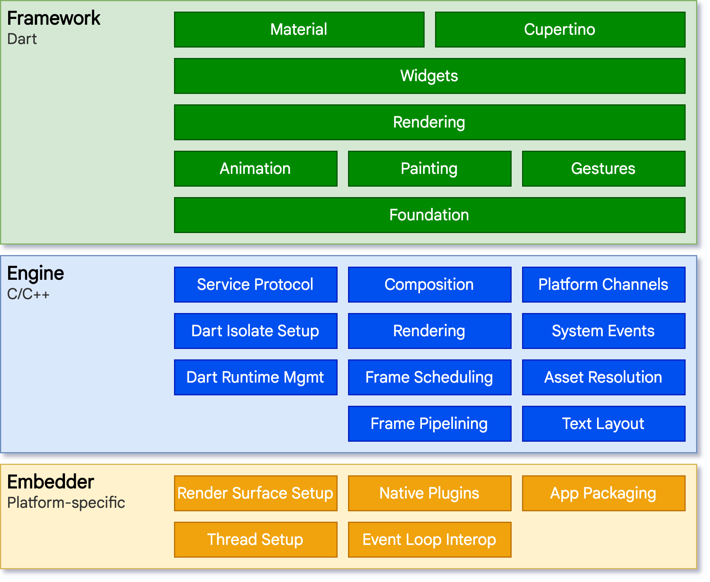

# What is Flutter
Flutter is a cross-platform UI toolkit that is designed to allow code reuse across operating systems such as iOS and Android, while also allowing applications to interface directly with underlying platform services.

# How Flutter run
During development, Flutter apps run in a VM that offers stateful hot reload of changes without needing a full recompile. For release, Flutter apps are compiled directly to machine code, whether Intel x64 or ARM instructions, or to JavaScript if targeting the web.

# Architectural Layers

## Embedder (Platform Specific)
A platform-specific embedder provides an entrypoint; coordinates with the underlying operating system for access to services like rendering surfaces, accessibility, and input; and manages the message event loop. The embedder is written in a language that is appropriate for the platform: currently Java and C++ for Android, Objective-C/Objective-C++ for iOS and macOS, and C++ for Windows and Linux.

- Coordinates with the underlying operating system for access to services like rendering surfaces, accessibility,   
  and input.
- Manages the event loop.
- Exposes platform-specific API to integrate the Embedder into apps.

## Flutter Engine
At the core of Flutter is the Flutter engine, which is mostly written in C++ and supports the primitives necessary to support all Flutter applications. The engine is responsible for rasterizing composited scenes whenever a new frame needs to be painted. It provides the low-level implementation of Flutter’s core API, including graphics (through Impeller on iOS and coming to Android, and Skia on other platforms) text layout, file and network I/O, accessibility support, plugin architecture, and a Dart runtime and compile toolchain.

- Responsible for rasterizing composited scenes.
- Provides low-level implementation of Flutter’s core APIs (for example, graphics, text layout, Dart runtime).
- Exposes its functionality to the framework using the dart:ui API.
- Integrates with a specific platform using the Engine’s Embedder API.

## Flutter Framwork
The engine is exposed to the Flutter framework through dart:ui, which wraps the underlying C++ code in Dart classes. This library exposes the lowest-level primitives, such as classes for driving input, graphics, and text rendering subsystems.

Typically, developers interact with Flutter through the Flutter framework, which provides a modern, reactive framework written in the Dart language. 

- Provides higher-level API to build high-quality apps (for example, widgets, hit-testing, gesture detection, 
  accessibility, text input).
- Composites the app’s widget tree into a scene.

